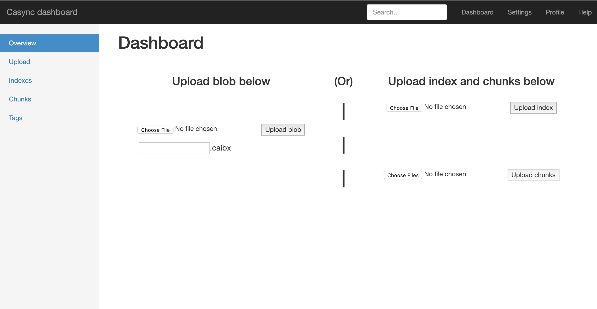
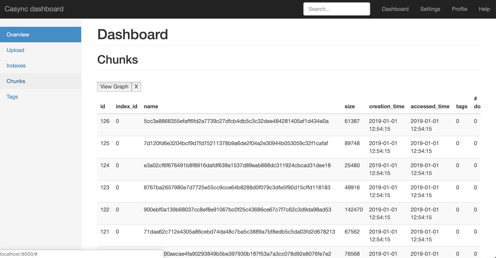
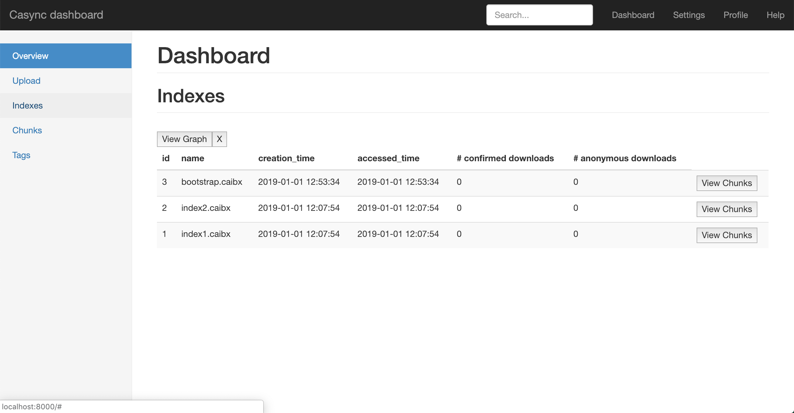
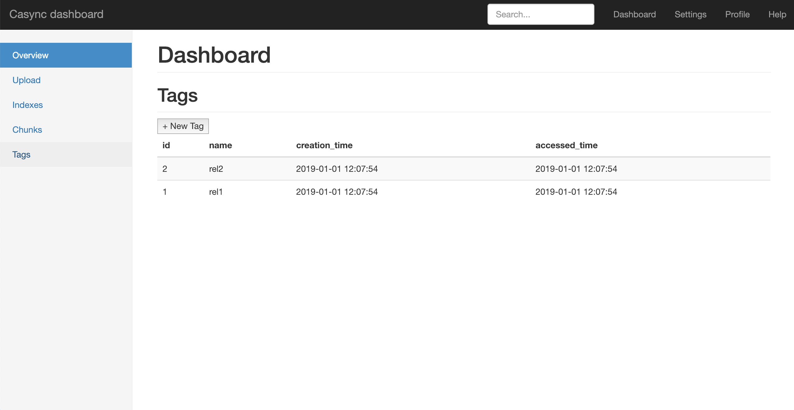
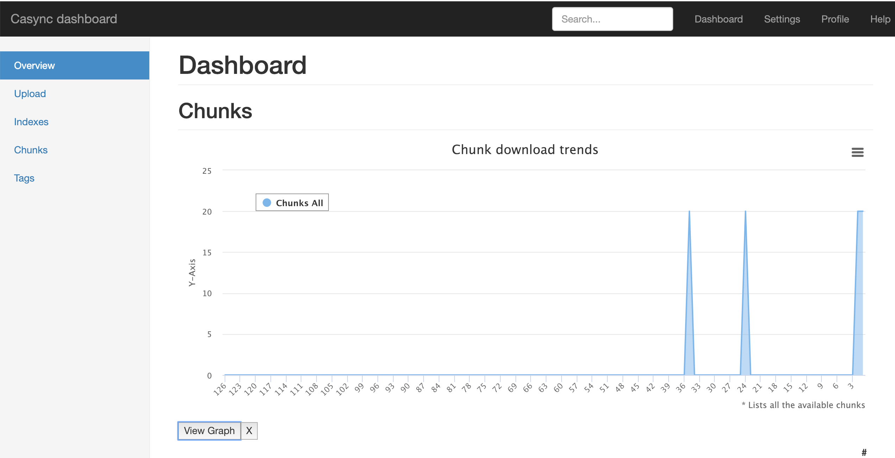
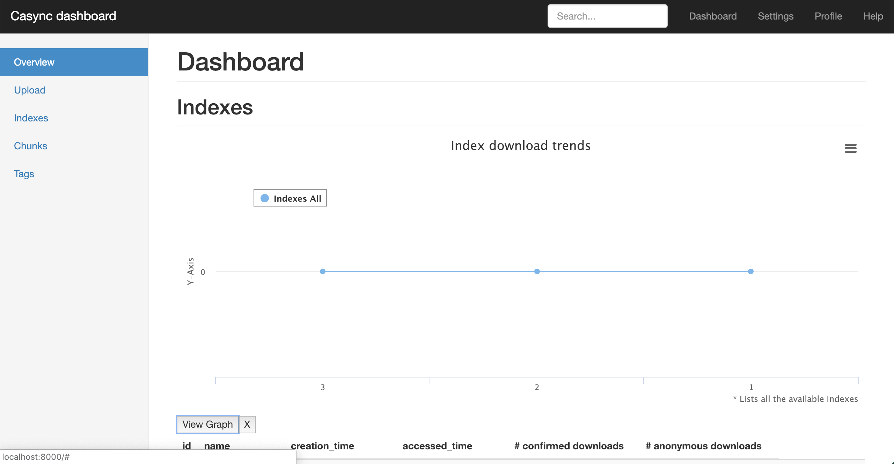

# casync-dashboard
A frontend dashboard(in web assembly) for managing content for casync,desync and casync-rs type tools 

## Build and run
``cargo web start --target wasm32-unknown-unknown``

## Screenshots of dashboard

### View for uploading chunks, indexes and blobs

### View for showing all chunks

### View for showing all indexes

### View for showing all tags

### View for showing download trends graph of chunks

### View for showing download trends graph of indexes

## How does this work?
### Frontend
- Current project is the frontend which gives lot of features like
  - Look at all chunks, indexes and their statistics like size, modified time, download count etc
  - Upload a blob, backend will take of chunking it and storing them in right places for serving
  - Upload index and chunks separately, if needed
  - Look at chunks related to an index
  - Attach tags to indexes (WIP)
### [Backend](https://github.com/krishnakumar4a4/casync-dashboard-backend)
- A webserver backed by postgresql database provides APIs as well as stores the metadata related to chunks, indexes etc. 
  This backend has much more flexibility and can also be used independent of the frontend dashboard.
